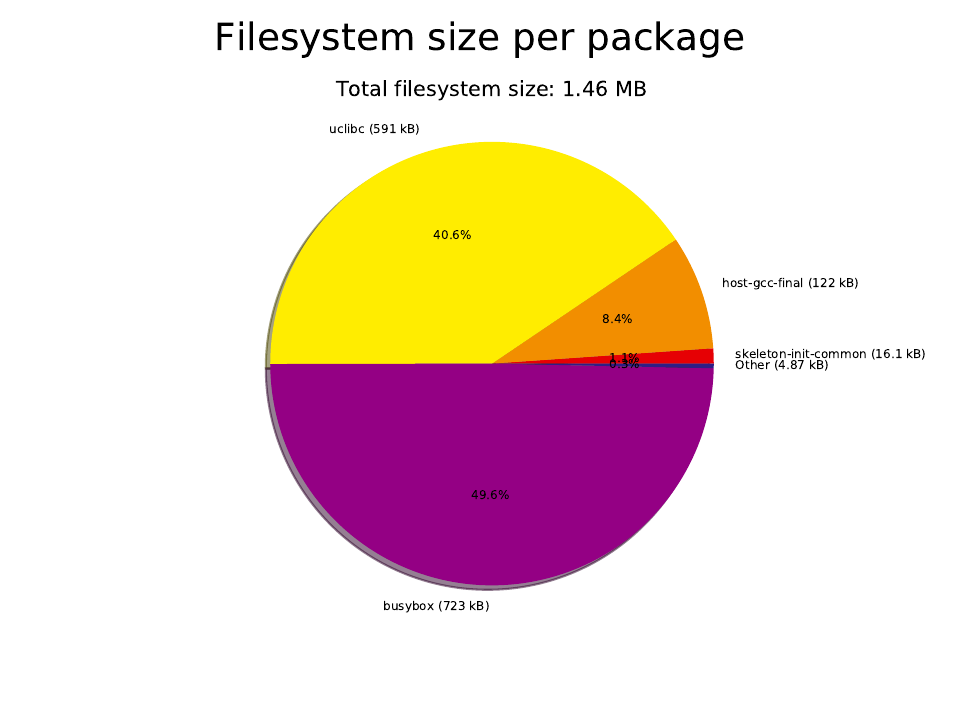

buildroot4minimalism
====================

Trying to build a minimal buildroot for using as the root in a container image.

Just using the default setup from buildroot, but without bootloader and kernel.

2022.02.x:
- GCC 10 (`BR2_GCC_VERSION_10_X=y`)
- Linux 5.15 (`BR2_KERNEL_HEADERS_5_15=y`)

Component      | Project       | Notes
-------------- | ------------- | ------------
C Library      | uclibc        | libc.so
Shell          | busybox       | /bin/sh
Packages       | buildroot     | make



* `board/`

* `configs/`

This is where the distribution targets are defined, with helper files and defconfig.

* `buildroot/`

* `output/`

This is where the sources and build happens, and where the output ends up afterwards.

* `support/`

Support files for building, such as a container image with all required build tools.

* `container/`

Contains helper files for constructing the container image from the rootfs archive.

Toolchains:

`i586-buildroot-linux-uclibc`

```
61M	i586-buildroot-linux-uclibc_sdk-buildroot.tar.gz
36M	i586-buildroot-linux-uclibc_sdk-buildroot.tar.xz
```

Reference board:

`i586` (386)

```
2.0M	rootfs.tar
1.6M	root.tar
```
